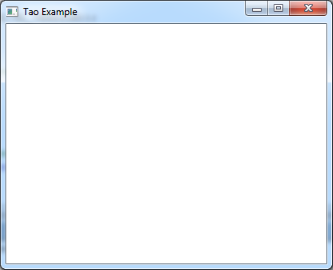

# Уроки программирования по PascalABC.Net и OpenGL (Tao Framework) 

Данная ветка github содержит все необходимы ресурсы для выполнение уроков продемонстрированных на канале TheMrDen3D в цикле уроков по [OpenGL](https://www.youtube.com/watch?v=8l9sJ2d9lJM&list=PLaHMNOpHDYwoEfnxIRn93AOMTKej-JJ53).

|----:|:----------|
| *[Урок №0. Что такое OpenGL](http://sabaka.net)* | По центру |
| По левому краю | По центру |
| По левому краю | По центру |
| По левому краю | По центру |
| По левому краю | По центру |

