# Уроки программирования по PascalABC.Net и OpenGL (Tao Framework) 

Данная ветка github содержит все необходимы ресурсы для выполнение уроков продемонстрированных на канале TheMrDen3D в цикле уроков по [OpenGL](https://www.youtube.com/watch?v=8l9sJ2d9lJM&list=PLaHMNOpHDYwoEfnxIRn93AOMTKej-JJ53).

|  |  |
|----:|:----------|
|||
| | |
|| |
|| |
|| |
|| |
|| |
|| |
|[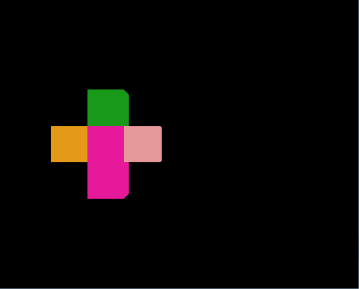](lessons/lesson_16.pas)|[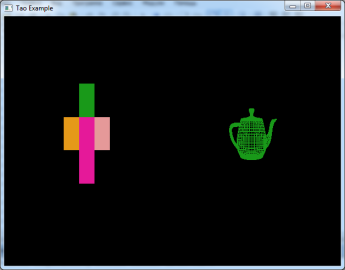](lessons/lesson_17.pas) |
|[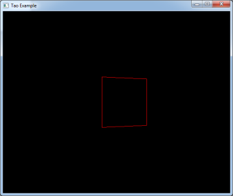](lessons/lesson_18.pas)|[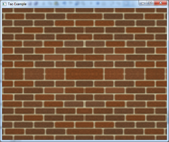](lessons/lesson_19.pas) |
|[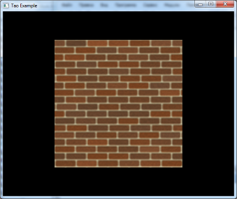](lessons/lesson_20.pas)|[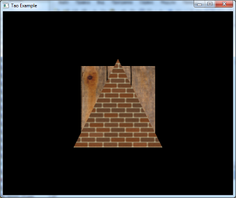](lessons/lesson_21.pas) |
|[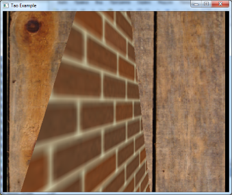](lessons/lesson_22.pas)|[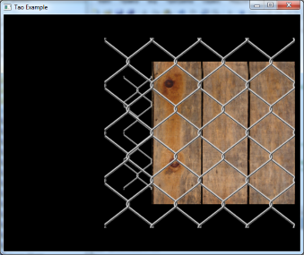](lessons/lesson_23.pas) |
|[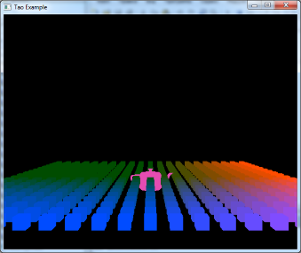](lessons/lesson_24.pas)|[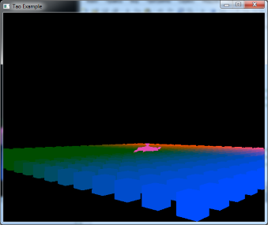](lessons/lesson_25.pas) |
|[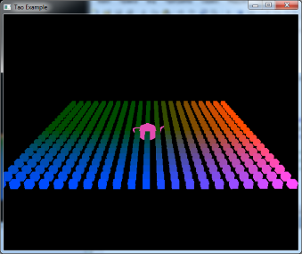](lessons/lesson_26.pas)|[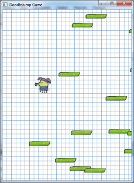](lessons/lesson_27.pas) |
|[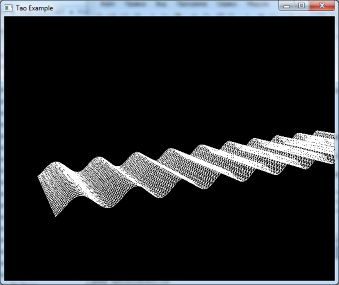](lessons/lesson_28.pas)|[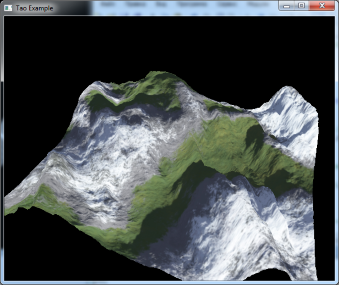](lessons/lesson_29.pas) |
|[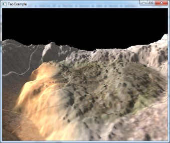](lessons/lesson_30.pas)|[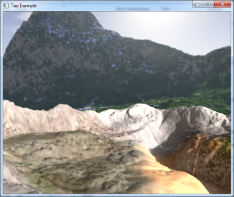](lessons/lesson_31.pas) |
|[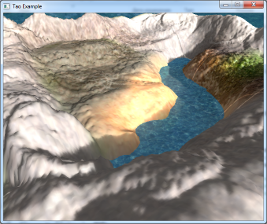](lessons/lesson_32.pas)|[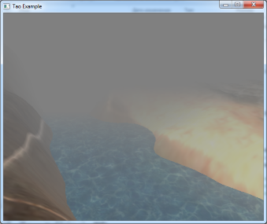](lessons/lesson_33.pas) |

