# Уроки программирования по PascalABC.Net и OpenGL (Tao Framework) 

Данная ветка github содержит все необходимы ресурсы для выполнение уроков продемонстрированных на канале TheMrDen3D в цикле уроков по [OpenGL](https://www.youtube.com/watch?v=8l9sJ2d9lJM&list=PLaHMNOpHDYwoEfnxIRn93AOMTKej-JJ53).

|  |  |
|----:|:----------|
|||
|[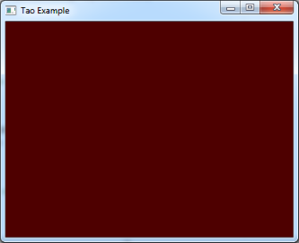](lessons/lesson_2.pas) | [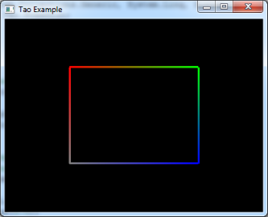](lessons/lesson_3.pas)|
|[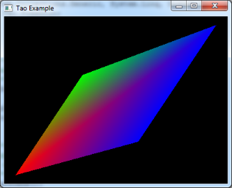](lessons/lesson_4.pas)| |
|[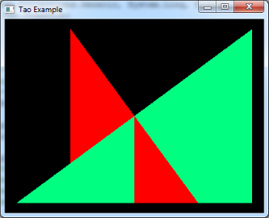](lessons/lesson_6.pas)|[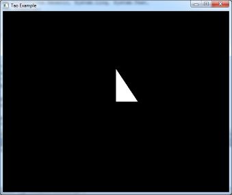](lessons/lesson_7.pas) |
||[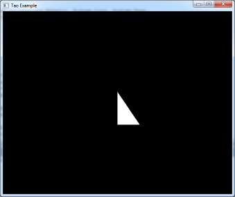](lessons/lesson_9.pas) |
|[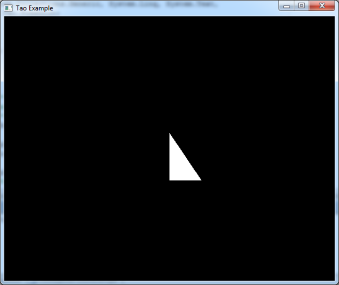](lessons/lesson_10.pas)|[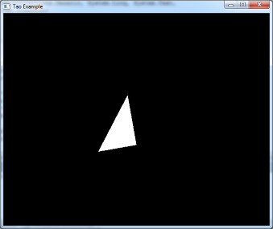](lessons/lesson_11.pas) |
|[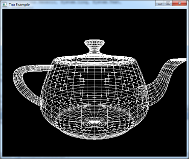](lessons/lesson_12.pas)|[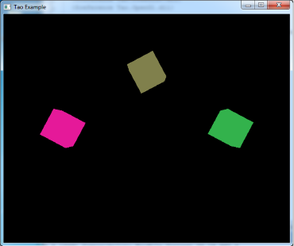](lessons/lesson_13.pas) |
|[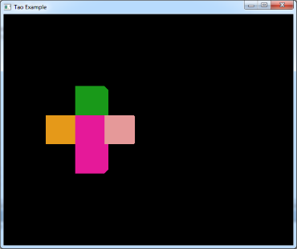](lessons/lesson_14.pas)|[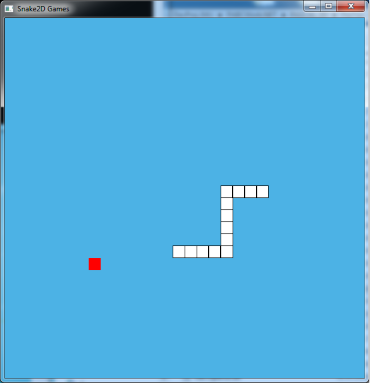](lessons/lesson_15.pas) |

