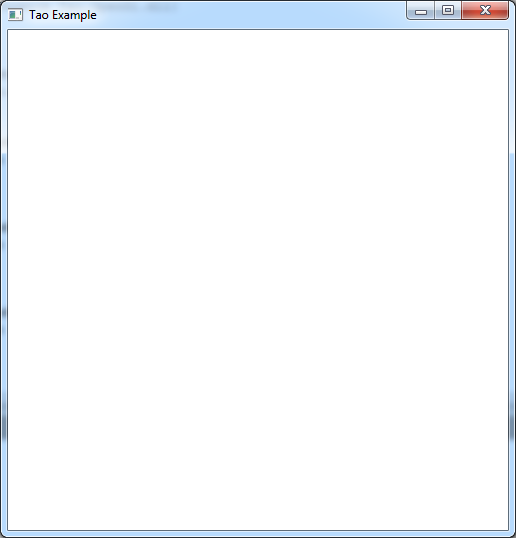
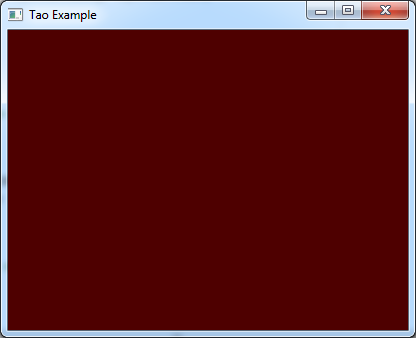
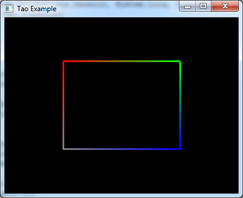
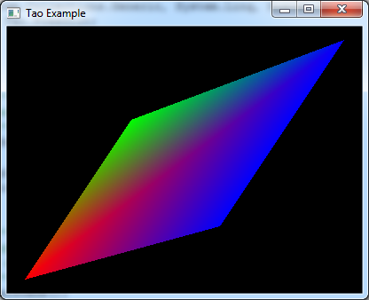
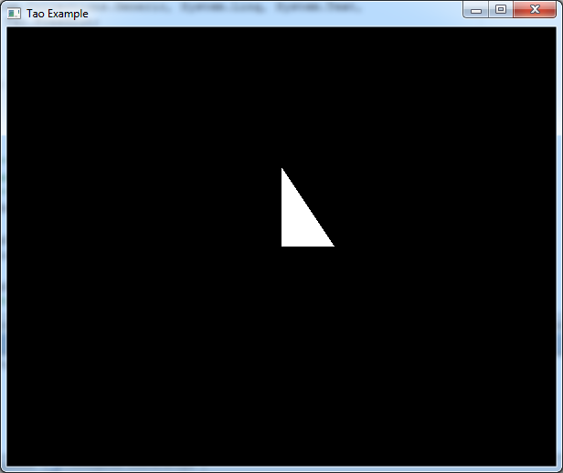
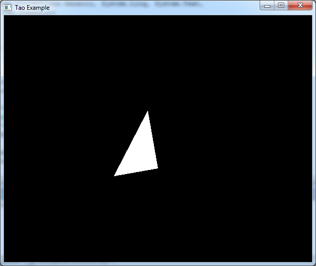
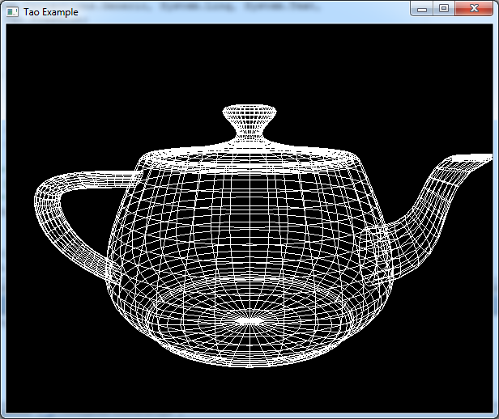

<!DOCTYPE html>
<html lang="en">

<head>
   <meta charset="utf-8">
</head>    
    
<body>
    <h1>Уроки программирования на PascalABC.Net и OpenGL (Tao Framework) </h1>
    

    
Данная ветка github содержит все необходимы ресурсы для выполнение уроков продемонстрированных на канале <a href="https://www.youtube.com/user/TheMrDen3D">TheMrDen3D</a> в цикле уроков по <a href="https://www.youtube.com/watch?v=8l9sJ2d9lJM&list=PLaHMNOpHDYwoEfnxIRn93AOMTKej-JJ53">OpenGL </a>.

    <table>
    <tr> 
        <td valign="top">
            
<b>Урок №0. Что такое OpenGL</b>  
            
            

        </td>
        <td valign="middle">
            
<b>Урок №1. Как узнать версию OpenGL</b>  
            
            

        </td>
    </tr>
    </table>    
    

        <b>Урок №2. Меняющийся цвет заднего фона</b>  
        
    
    
    

        <b>Урок №3. Создание первого примитива</b>  
        
    

    

        <b>Урок №4. Треугольники и квадраты</b>  
        
    

    

        <b>Урок №5. Двойная буферизация</b>  
        
    

    

        <b>Урок №6. Z-буфер или буфер глубины</b>  
        
    
    
    

        <b>Урок №7. Матрицы. Настройка перспективы</b>  
        
    
    
    

        <b>Урок №8. Дальность видимости</b>  
        
    

    

        <b>Урок №9. Настройка камеры</b>  
        
    

    

        <b>Урок №10. Перемещение, вращение и масштабирование объекта</b>  
        
    

    

        <b>Урок №11. Анимация объекта</b>  
        
    

    

        <b>Урок №12. Объемные модели</b>  
        
    

    

        <b>Урок №13. Работа с несколькими объектами</b>  
        
    

    

    Copyright 2018 TheMrDen3D, All Rights Reserved.
</body>    

</html>
